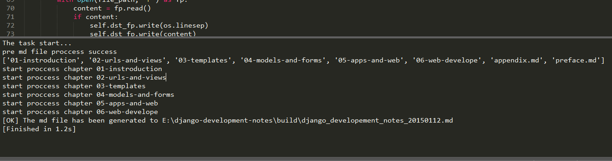

# Md文件处理

By Kinegratii(kinegratii@gmail.com)

## 前言

所有的工作都开始于一本名称叫做django-development-notes的笔记，这本笔记将断断续续写的有关Django的一些记录整理成一本书。

所有文件和工作都是在django-development-notes目录下。它的结构如下：

* book/
    * 01-introduction/
        * 0101-basic-mtv.md
        * ...
    * 02-urls-and-views/
        * 0201-urlpatterns.md
        * 0202-fbv-and-cbv.md
        * ...
        * middleware.png
    * preface.md
    * appendix.md
* build/
    * django-development-notes-20150112.md
    * middleware.png
    * ...
* merge_md.py

book下面是各个章节的目录及其md文件，为了使用方便，章文件夹名称格式为01-xxx，其下的md文件相应的被命名为0101-xxx.md，这样也代表了这本书的先后顺序。

merge_md.py脚本主要完成：

* 将 前言md文件 + 每一章的md文件（格式类似0101-xxxx.md） + 附录md文件合并到一起。
* 将所有引用的静态文件复制到与目标md文件同目录下面
* 前言和附录文件可以是多个md文件

## 使用方式

实例化一个处理器传递各个参数
<pre>
def main():
    book_md_name = datetime.now().strftime('django_developement_notes_%Y%m%d.md')
    p = MDMergeProccessor(
        src_dir='book',
        pre_mds=['preface.md'],
        chapter_dirs_prex = ['01','02','03','04','05', '06'],
        appendix_mds = ['appendix.md',],
        dst_dir='build',
        book_md=book_md_name)
    p.proccess()
</pre>

各个参数意义如下：

* src_dir：书本目录
* pre_mds：列表，前言md文件名
* chapter_dirs_prex：各章的文件前缀
* appendix_mds：列表，附录md文件名
* dst_dir：生成的书本目录
* book_md：生成书本的文件名

结果如下：

## 代码要点

1. os.path的几个函数使用

<pre>
    # 基本路径
    self.base_path = os.path.dirname(__file__)
    
    # 书本目录
    self.book_path = os.path.join(self.base_path, self.src_dir)

    # 如果某一目录不存在就创建
    if not os.path.exists(self.dst_book_dir):
        os.makedirs(self.dst_book_dir)
</pre>

2 复制文件

<pre>
    def _copy_media(self, parent_path, file_name):
        src_path = os.path.join(parent_path, file_name)
        dst_path = os.path.join(self.dst_book_dir, file_name)
        if not os.path.exists(dst_path):
            shutil.copyfile(src_path,dst_path)
</pre>

3 使用with语句读写文件，其中self.dst_fp没有使用with语句，需调用close函数关闭

<pre>
    def _add_to_dst_file(self, file_path):
        with open(file_path, 'r') as fp:
            content = fp.read()
            if content:
                self.dst_fp.write(os.linesep)
                self.dst_fp.write(content)
</pre>

## 总结

1. 在文件路径处理上，首先确定一个基本路径（绝对路径），一般是最外层的目录，其他所有路径用os.path.join函数构造。

